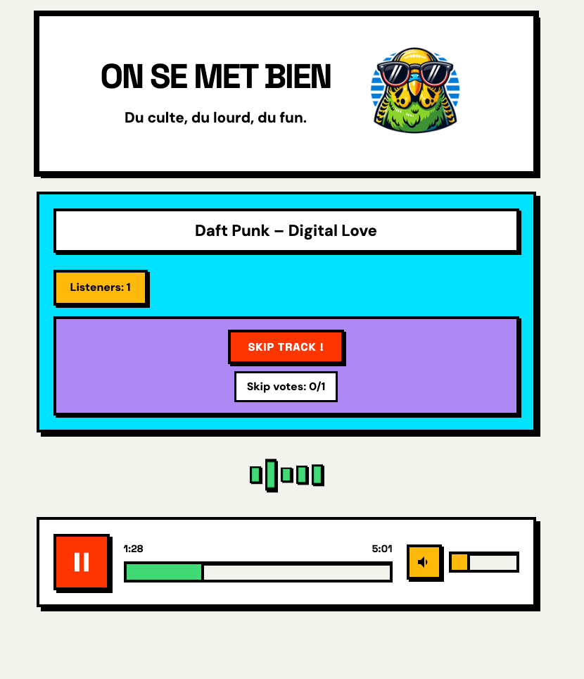

# On se met bien - Web Radio System

A TypeScript-based web radio system for "On se met bien", a French web radio station. This project handles music management, cloud storage, and live streaming with automatic track scheduling.



Visit our website: [On se met bien](https://www.onsemetbien.net/)

## Contributing

See [CONTRIBUTING-ADDING-TRACKS.md](CONTRIBUTING-ADDING-TRACKS.md) for details on how to contribute to this project.

## Features

- 🎵 Music Library Management
  - Download and process YouTube videos into MP3 format
  - Automatic upload to OVH Cloud Storage
  - Track categorization (music, excerpts, sketches)
  - Metadata management including duration and track types

- 🔄 Intelligent Track Scheduling
  - Random track selection with type variation
  - Prevents repetitive play of similar content
  - Automatic track rotation once playlist is completed

- 🎧 Live Streaming
  - Real-time listener count
  - Secure audio delivery via signed URLs
  - WebSocket-based real-time updates
  - Browser-based playback interface

## Prerequisites

- Node.js (v14 or higher)
- MongoDB database
- OVH S3-compatible storage account
- [yt-dlp](https://github.com/yt-dlp/yt-dlp)
- [ffmpeg](https://ffmpeg.org/)

## Installation

1. Clone this repository
2. Install dependencies:
```bash
npm install
```

3. Create a `.env` file with the following variables:
```env
PORT=3000
MONGODB_URI=your_mongodb_uri
OVH_REGION=your_ovh_region
OVH_BUCKET=your_bucket_name
OVH_ACCESS_KEY_ID=your_access_key
OVH_SECRET_ACCESS_KEY=your_secret_key
```

## Usage

### Starting the Radio Server

```bash
npm start
```

### Adding New Tracks

Add tracks to the radio library using one of these commands:

```bash
# For music tracks
npm run dl:music -- <youtube-url>

# For radio excerpts
npm run dl:excerpt -- <youtube-url>

# For comedy sketches
npm run dl:sketch -- <youtube-url>
```

## Architecture

- **Frontend**: Static HTML/JS served by Express
- **Backend**: Node.js with Express and Socket.IO
- **Storage**: OVH S3-compatible cloud storage
- **Database**: MongoDB for track management
- **Real-time**: Socket.IO for live listener counts and track updates

## Technical Details

- Automatic track type rotation for varied content
- Secure URL generation for audio files
- Real-time listener tracking
- Automatic cleanup of local files after cloud upload
- Error handling and retry mechanisms

## Dependencies

- Express.js: Web server framework
- Socket.IO: Real-time communication
- MongoDB/Mongoose: Database management
- AWS SDK: S3 compatible storage operations
- youtube-dl-exec: YouTube download functionality
- TypeScript: Type-safe development

## License

MIT
