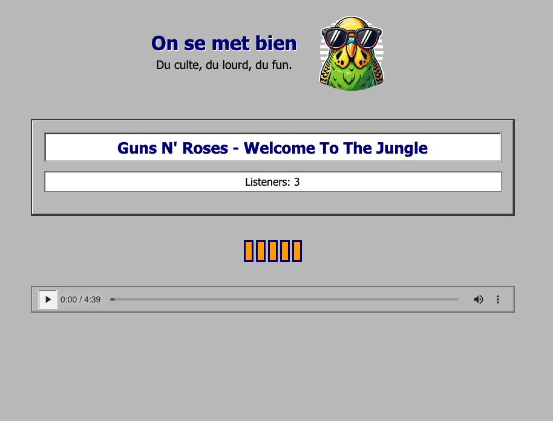

# On se met bien - 🇫🇷 French Web Radio

A TypeScript-based web radio system for "On se met bien", a French web radio station streaming curated audio content — music, comedy excerpts, and sketches — with a colorful neobrutalist design and real-time listener experience.



Visit the webradio: [On se met bien](https://www.onsemetbien.net/)

## Contributing

See [CONTRIBUTING-ADDING-TRACKS.md](CONTRIBUTING-ADDING-TRACKS.md) for details on how to propose tracks.

## Features

- 🎵 **Music Library Management**
  - Download and process YouTube videos into MP3 format
  - Automatic upload to OVH Cloud Storage
  - Track categorization: music, excerpts, sketches, jingles
  - Metadata management including duration and track types

- 🔄 **Intelligent Track Scheduling**
  - Random track selection with type variation
  - Prevents repetitive play of similar content
  - Automatic track rotation with history (last 20 tracks excluded)

- 🎧 **Live Streaming**
  - Real-time synchronized playback — all listeners hear the same track at the same position
  - Gapless playback: the next track is pre-buffered and crossfaded in, so audio is never cut between tracks
  - "À suivre" panel showing the next 5 upcoming tracks
  - Audio-reactive equalizer (Web Audio spectrum, Winamp-style) with a synthesized fallback
  - Secure audio delivery via signed URLs (OVH S3)
  - WebSocket-based real-time updates via Socket.IO
  - Browser-based neobrutalist player interface

- 🗳️ **Skip Voting**
  - Listeners can vote to skip the current track
  - 50% of active listeners required to trigger a skip

## Prerequisites

- Node.js 20+
- pnpm (package manager)
- MongoDB (local or cloud)
- OVH S3-compatible storage account
- [yt-dlp](https://github.com/yt-dlp/yt-dlp)
- [ffmpeg](https://ffmpeg.org/)

## Installation

1. Clone this repository
2. Install dependencies:
```bash
pnpm install
```

3. Create a `.env` file based on `.env.example`:
```env
PORT=3001
MONGODB_URI=mongodb://localhost:27017/webradio
OVH_REGION=eu-west-par
OVH_BUCKET=your-bucket
OVH_ACCESS_KEY_ID=your-access-key
OVH_SECRET_ACCESS_KEY=your-secret-key
```

## Usage

### Starting the Radio Server

```bash
pnpm dev:radio
```

This runs the Express/Socket.IO server (`:3001`) **and** the Vite dev server (`:5173`)
concurrently. In development, open **http://localhost:5173** — Vite serves and transpiles
the TypeScript client and proxies `/socket.io` and `/health` to the server on `:3001`.
(The server on `:3001` serves the already-built client only in production.)

### Audio-reactive equalizer (OVH S3 CORS)

The equalizer reacts to the real audio signal via the Web Audio API. Because audio is
served cross-origin from OVH S3, the browser only exposes the signal to the analyser when
the bucket returns **CORS** headers. Without CORS everything still works — playback is
untouched and the equalizer falls back to a synthesized animation — but to enable the real
spectrum, allow the site origins on the bucket.

Create `cors.json`:

```json
{
  "CORSRules": [
    {
      "AllowedOrigins": [
        "https://onsemetbien.net",
        "https://www.onsemetbien.net",
        "http://localhost:*",
        "https://localhost:*",
        "http://127.0.0.1:*"
      ],
      "AllowedMethods": ["GET", "HEAD"],
      "AllowedHeaders": ["*"],
      "ExposeHeaders": ["Content-Length", "Content-Range", "Accept-Ranges", "ETag"],
      "MaxAgeSeconds": 3600
    }
  ]
}
```

Apply it with the AWS CLI against the OVH S3 endpoint
([OVH S3 endpoints & regions](https://docs.ovhcloud.com/fr/guides/storage-and-backup/object-storage/s3-location)):

```bash
aws s3api put-bucket-cors \
  --bucket "$OVH_BUCKET" \
  --cors-configuration file://cors.json \
  --endpoint-url "https://s3.$OVH_REGION.io.cloud.ovh.net"

# verify
aws s3api get-bucket-cors --bucket "$OVH_BUCKET" \
  --endpoint-url "https://s3.$OVH_REGION.io.cloud.ovh.net"
```

`http://localhost:*` uses the S3 port wildcard, so any localhost port is allowed. It is a
bucket-level setting and takes effect immediately (no redeploy).

### Adding New Tracks

```bash
# Download music tracks
pnpm dl:music

# Download excerpt tracks
pnpm dl:excerpt

# Download sketch tracks
pnpm dl:sketch

# Search YouTube for tracks
pnpm search:tracks

# Batch upload tracks
pnpm bulk:upload
```

## Architecture

```
onsemetbien/
├── public/          # Frontend static assets (index.html, logo)
├── src/             # Main server source (Express + Socket.IO)
│   ├── server.ts    # Core server
│   ├── models/      # Mongoose models
│   ├── services/    # Business logic (storage, track scheduling)
│   └── scripts/     # Utility scripts
├── apps/
│   ├── webradio/    # Web radio server package
│   └── backoffice/  # Management interface
├── shared/          # Shared types & models
└── tools/           # CLI utilities
```

- **Frontend**: Single-page HTML/JS with neobrutalist design, served by Express
- **Backend**: Node.js with Express and Socket.IO
- **Storage**: OVH S3-compatible cloud storage
- **Database**: MongoDB (Mongoose) for track metadata
- **Real-time**: Socket.IO for listener counts, track changes, and skip votes

## Deployment

Deployed on [Railway](https://railway.app/). Docker support available via `docker-compose.yml`.

- Health check: `GET /health`
- Config: `railway.json` and `Procfile`

## License

MIT
