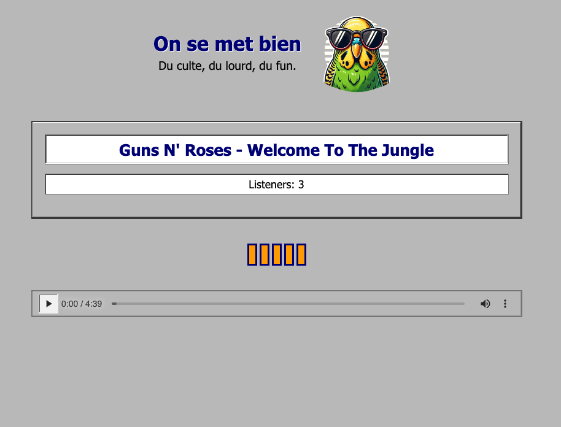

# On se met bien - 🇫🇷 French Web Radio

A TypeScript-based web radio system for "On se met bien", a French web radio station streaming curated audio content — music, comedy excerpts, and sketches — with a colorful neobrutalist design and real-time listener experience.



Visit the webradio: [On se met bien](https://www.onsemetbien.net/)

## Contributing

See [CONTRIBUTING-ADDING-TRACKS.md](CONTRIBUTING-ADDING-TRACKS.md) for details on how to propose tracks.

## Features

- 🎵 **Music Library Management**
  - Download and process YouTube videos into MP3 format
  - Automatic upload to OVH Cloud Storage
  - Track categorization: music, excerpts, sketches, jingles
  - Metadata management including duration and track types

- 🔄 **Intelligent Track Scheduling**
  - Random track selection with type variation
  - Prevents repetitive play of similar content
  - Automatic track rotation with history (last 20 tracks excluded)

- 🎧 **Live Streaming**
  - Real-time synchronized playback — all listeners hear the same track at the same position
  - Secure audio delivery via signed URLs (OVH S3)
  - WebSocket-based real-time updates via Socket.IO
  - Browser-based neobrutalist player interface

- 🗳️ **Skip Voting**
  - Listeners can vote to skip the current track
  - 50% of active listeners required to trigger a skip

## Prerequisites

- Node.js 20+
- pnpm (package manager)
- MongoDB (local or cloud)
- OVH S3-compatible storage account
- [yt-dlp](https://github.com/yt-dlp/yt-dlp)
- [ffmpeg](https://ffmpeg.org/)

## Installation

1. Clone this repository
2. Install dependencies:
```bash
pnpm install
```

3. Create a `.env` file based on `.env.example`:
```env
PORT=3001
MONGODB_URI=mongodb://localhost:27017/webradio
OVH_REGION=eu-west-par
OVH_BUCKET=your-bucket
OVH_ACCESS_KEY_ID=your-access-key
OVH_SECRET_ACCESS_KEY=your-secret-key
```

## Usage

### Starting the Radio Server

```bash
pnpm dev:radio
```

### Adding New Tracks

```bash
# Download music tracks
pnpm dl:music

# Download excerpt tracks
pnpm dl:excerpt

# Download sketch tracks
pnpm dl:sketch

# Search YouTube for tracks
pnpm search:tracks

# Batch upload tracks
pnpm bulk:upload
```

## Architecture

```
onsemetbien/
├── public/          # Frontend static assets (index.html, logo)
├── src/             # Main server source (Express + Socket.IO)
│   ├── server.ts    # Core server
│   ├── models/      # Mongoose models
│   ├── services/    # Business logic (storage, track scheduling)
│   └── scripts/     # Utility scripts
├── apps/
│   ├── webradio/    # Web radio server package
│   └── backoffice/  # Management interface
├── shared/          # Shared types & models
└── tools/           # CLI utilities
```

- **Frontend**: Single-page HTML/JS with neobrutalist design, served by Express
- **Backend**: Node.js with Express and Socket.IO
- **Storage**: OVH S3-compatible cloud storage
- **Database**: MongoDB (Mongoose) for track metadata
- **Real-time**: Socket.IO for listener counts, track changes, and skip votes

## Deployment

Deployed on [Railway](https://railway.app/). Docker support available via `docker-compose.yml`.

- Health check: `GET /health`
- Config: `railway.json` and `Procfile`

## License

MIT
